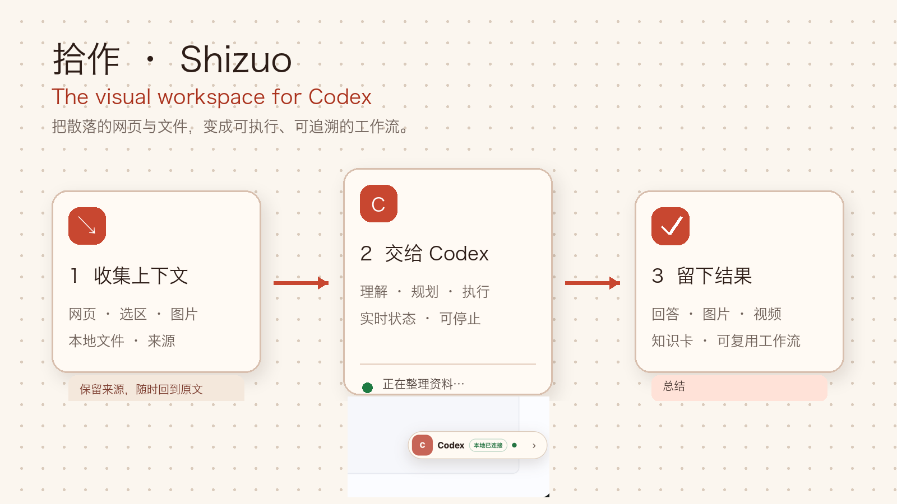
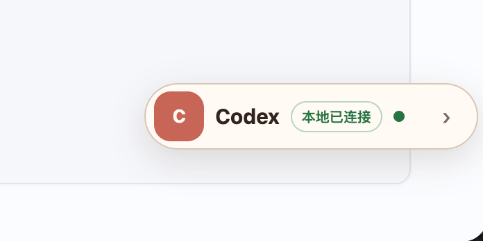

# 拾作 · Shizuo

> **The visual workspace for Codex.** Capture context, think on an infinite canvas, and let local agents act with visible, traceable results.

把网页、选区、图片和本地文件放进同一块画布，让 Codex 理解关系、执行任务，并把结果留在上下文旁边。


[Download v2.24.0](https://github.com/Amossse/shizuo-codex-workspace/archive/refs/tags/v2.24.0.zip) · [Quick start](#quick-start) · [How it works](#how-it-works) · [Contributing](CONTRIBUTING.md)



---

## Why Shizuo

Chat windows lose context. Web clippers stop at collection. Whiteboards still ask you to move everything by hand.

Shizuo keeps the material, its relationships, the agent's work, and the result in one local-first workspace:

- **Capture real context** — webpages, selections, images, links, and local files keep their source.
- **See the structure** — arrange cards on an infinite canvas and connect inputs to outputs.
- **Let Codex act** — run local tasks through MCP and watch status, progress, and results on the canvas.
- **Reuse the outcome** — keep answers, images, knowledge cards, provenance, and workflows beside the source.

Core capture and canvas data stay local with zero analytics. Codex runs only when you ask it to.

## Quick start

### 1. Install the extension

1. Download [`shizuo-codex-workspace-2.24.0.zip`](https://github.com/Amossse/shizuo-codex-workspace/archive/refs/tags/v2.24.0.zip) and unzip it.
2. Open `chrome://extensions` or `edge://extensions`.
3. Enable **Developer mode**, choose **Load unpacked**, and select the unzipped folder.
4. Pin 拾作. On any webpage, save the page or selected content; open a new tab to enter the canvas.

You can now capture, edit, organize, search, and export locally. Connecting Codex is optional.

### 2. Connect local Codex on macOS

Copy the extension ID shown in `chrome://extensions`, then run:

```bash
PAGEDOCK_EXTENSION_ID=your_extension_id ./install.sh
```

Reload 拾作 once from `chrome://extensions`. A green **本地已连接** state confirms the local bridge is ready.

```bash
sh "$HOME/.codex/skills/shizuo/scripts/shizuo.sh" health
```

## How it works

```text
Webpages / selections / local files
                ↓
      source cards on the canvas
                ↓
    Codex reads, plans, and acts
                ↓
 answers / images / knowledge / workflows
```

On supported webpages, the compact assistant is injected automatically and reconnects to the local bridge in the background:

<p align="center">
  
</p>

## Core capabilities

- Smart webpage extraction to clean Markdown with source metadata
- Local-first multi-board canvas with cards, links, grouping, search, and revision history
- Context-aware Codex tasks with visible progress, cancellation, retry, and linked results
- Page assistant for questions, translation, summarization, analysis, and pasted images
- Portable board export, PNG/PDF output, full backup, and restore
- MCP bridge and bundled `shizuo` Skill for local Agent operations

<details>
<summary><strong>Advanced and experimental capabilities</strong></summary>

Local terminals, HyperFrames/Remotion video, Kokoro post-production, dynamic and scheduled workflows, trusted-LAN collaboration, session preview, and AGY runtime switching are available for advanced setups. They are intentionally outside the first-use path.

</details>

<details>
<summary><strong>Full capability reference</strong></summary>

Most web clippers ship raw HTML, dump unformatted text, or pipe your data through a cloud service. **拾作** keeps page capture, understanding, and visual creation together:

- 🧹 **Smart extraction** — Mozilla Readability isolates the real article and drops nav / sidebar / footer noise
- ✍️ **Clean Markdown** — Turndown + GFM produces portable CommonMark you can paste into Obsidian, Logseq, Notion, Bear, Feishu, GitHub, Hugo, …
- 🖥️ **Real editor** — Monaco (the VS Code editor) with word wrap, find & replace, and a warm light reading theme
- 👀 **Live preview** — code / split / preview modes; `Cmd/Ctrl + 1/2/3` to switch
- ↔️ **Resizable split view** — drag the center divider to resize source and preview panes; the ratio is remembered
- 🗂️ **Multiple boards** — browse every board from the new-tab home, then open a board to view and edit its details
- 📥 **One-step collection** — right-click selected text, images, links, or a page to save it into the Inbox with source metadata
- 🧠 **Expanding whiteboard editing** — drag or pan in any direction to grow the canvas on demand, with zoom, multi-select, align, group, undo/redo, keyboard shortcuts, and minimap navigation
- 🌐 **Analyzable page cards** — enter an HTTP(S) URL to browse it inside a resizable card; when sent to Codex, approve that domain once and 拾作 extracts the rendered, authenticated page content instead of passing only the URL
- 🧩 **Typed card protocol** — every card declares its content inputs, outputs, runtime state, data connections, and capability permissions through one versioned contract
- 🔗 **Content-carrying connections** — connect two selected cards in source → target order; documents receive a snapshot and Codex tasks read the latest upstream content whenever they run
- 📁 **Local file and folder cards** — choose local material with explicit browser permission, keep handles separate from portable board data, refresh previews, and reconnect safely after import
- 📝 **Document and code cards** — write Markdown with an inline preview or keep resizable, language-labelled source code directly on the canvas
- `>_` **Interactive local terminals** — use a persistent login shell backed by a real PTY, with native prompts, history, completion, ANSI color, Ctrl+C, vim/top, resize, and bounded scrollback
- 🧭 **Relationship-aware canvas** — keep source-to-Codex-to-result links visible, then optimize the whole board into a cleaner left-to-right layout with one click
- 🧭 **Side-panel Inbox** — multi-select collected cards, move them to a board, archive/restore/delete in batches, and jump back to their source pages
- 🤖 **Independent Codex workspace chat** — use coding-mode Codex from the lower-right, then place any useful answer onto the current board with one click
- ⚡ **Codex on every page** — use a draggable, collapsible quick entry on supported pages; select text to ask Codex, translate it to Chinese, summarize, analyze, or find new insights without leaving the page
- 🔌 **Codex-to-whiteboard MCP** — let a local or explicitly authorized LAN Codex read and edit boards while the canvas shows its live task status, progress, linked outputs, and final result
- 🔎 **Cross-board search and provenance** — search card content and captured sources across every board, then inspect the exact upstream cards, source URLs, templates, and card revisions behind a result
- 🧰 **Reusable workflows** — save a board as a permission-clean workflow template, instantiate it with remapped links, and run task-card dependency waves with cycle detection and bounded concurrency
- 🧭 **Dynamic workflows** — describe a multi-step goal once, let Codex plan a validated DAG, then watch query, text, image-gen, and video execution containers run with live status and linked results
- 🕘 **Version history** — keep 100 local delta revisions per board and restore a chosen version as a new, auditable revision
- 📄 **Warm paper workbench** — one soft, bright Coral design system across the whiteboard, Codex, Inbox, popup, and Markdown editor
- ✨ **Multi-turn selection tasks** — keep each task card's material context and conversation history, read structured Markdown answers, continue asking follow-up questions, or launch text-summary, image, and video shortcuts from the same card
- ✅ **Concurrent, recoverable Codex tasks** — run up to three independent local tasks, follow user-readable process events in each card, reconnect after a page refresh, and stop or retry cards independently; image and video generation each stay limited to one at a time
- 🔊 **Narration quality gate** — segment spoken Chinese by scene, normalize numbers and domain terms for pronunciation, repair weak takes before render, duck music under speech, and normalize the final mix
- 💾 **IndexedDB persistence** — board records and imported image data stay out of `chrome.storage.local` size limits
- 📦 **Portable exports** — current-board `.pagedock`, PNG, PDF, plus full backup and restore
- 📸 **Full-page screenshot PDF** — preserve native pixel density and combine any number of capture segments into one multi-page PDF
- 🧩 **Virtual-scroll support** — accumulate rendered document blocks instead of reading only the first screen
- 🔒 **Privacy-first** — core capture and whiteboards stay local with zero analytics; optional Codex analysis runs only on explicit request
- 📦 **No build step** — pure JavaScript, all deps vendored; load unpacked and you're done

</details>

## Installation profiles

拾作 uses Chrome Native Messaging and your existing Codex CLI login. It never sends Codex credentials to the extension. Video generation additionally requires the `hyperframes` CLI and FFmpeg in your shell `PATH`.

```bash
PAGEDOCK_EXTENSION_ID=your_extension_id ./install.sh              # Core: Codex + MCP
PAGEDOCK_EXTENSION_ID=your_extension_id ./install.sh --terminal   # 核心 + 本地终端
PAGEDOCK_EXTENSION_ID=your_extension_id ./install.sh --video      # 核心 + 终端 + 视频依赖检查
```

The installer registers `com.pagedock.codex` for the unpacked extension ID shown in `chrome://extensions` and creates an isolated Codex workspace. Whiteboard task cards and the independent lower-right chat run as Codex coding agents with local tools and `workspace-write` access to `~/code` when that directory exists; material-analysis shortcuts remain read-only. Experimental terminal cards open the configured login shell only after the user explicitly connects the card. Experimental video generation uses HyperFrames or Remotion to create silent video; optional Kokoro post-production can add narration and subtitles afterward. Reload 拾作 once from `chrome://extensions` after installation. To choose another coding root:

```bash
PAGEDOCK_EXTENSION_ID=your_extension_id ./native-host/install-macos.sh
PAGEDOCK_CODING_WORKSPACE=/absolute/path/to/code ./native-host/install-macos.sh
```

### Let Codex actively operate a whiteboard

The macOS installer also creates a random bridge token and installs an MCP adapter at:

```text
~/Library/Application Support/PageDock/shizuo-mcp-server.mjs
```

It also installs the `shizuo` Skill into `~/.codex/skills/shizuo`. In a new Codex session, requests such as “读取拾作白板”“把这段结论放进拾作” or “开启拾作内网连接” will load the Skill and follow its connection, permission, mutation, and verification workflow. Deterministic setup commands are available directly:

```bash
sh "$HOME/.codex/skills/shizuo/scripts/shizuo.sh" health
sh "$HOME/.codex/skills/shizuo/scripts/shizuo.sh" status
sh "$HOME/.codex/skills/shizuo/scripts/shizuo.sh" local
```

The bridge listens only on `127.0.0.1:43127` by default. Add it to Codex's `~/.codex/config.toml`; the local MCP adapter reads the protected token file automatically:

```toml
[mcp_servers.shizuo]
command = "node"
args = ["/Users/your-name/Library/Application Support/PageDock/shizuo-mcp-server.mjs"]
```

Restart Codex and it can read, search, edit, stream, connect, comment, publish presence, and long-poll collaboration events through the `shizuo_*` tools. Chrome and the 拾作 extension must be running because the extension remains the only owner of IndexedDB. Embedded image/video data, browser file handles, terminal execution, and unrestricted shell access are not exposed.

The local Native Host also observes Codex Desktop turn start, completion, and cancellation events, so the collaboration pet reflects the current local task even when that turn does not call `shizuo_report_task`. Only lifecycle metadata and a short user-request title are forwarded; response content, hidden reasoning, terminal logs, and credentials are never read into the plugin.

To collaborate on the same trusted private network, open a board and click **邀请协作**. The primary one-time link opens a live browser board without requiring 拾作 or Codex; people can create, edit, move, resize, and connect cards immediately, while the owner can still downgrade them to ask-each-time or read-only. A separate expandable instruction connects another Codex directly from its terminal. Every claimed invitation receives its own token restricted to the currently open board, and optimistic version checks prevent silent overwrites. Use **停止共享** to revoke every browser and Codex session and return to local-only mode.

LAN mode accepts only loopback/private source addresses and rate-limits authenticated clients, but HTTP traffic is not end-to-end encrypted. Use it only on a trusted intranet. Do not distribute the host-owner token: only a one-time canvas invite may issue a remote, board-scoped client token. Card deletion remains disabled unless separately authorized. Return to the safe defaults at any time:

```bash
node "$HOME/Library/Application Support/PageDock/configure-bridge.mjs" --local --deny-delete
```

### Chrome Web Store / Edge Add-ons

🚧 Coming soon — listing links will appear here once approved.

## 🧭 Usage

| Action | How |
| --- | --- |
| Open tool menu | Click the toolbar icon |
| Parse Markdown | Pick `Markdown` once from the save-format menu, then choose `保存当前页`; the complete result opens in the editor |
| Capture full page | Pick `PDF` once from the save-format menu, then choose `保存当前页`; each scroll pauses briefly for dynamic rendering before one PDF is produced |
| Open 拾作 home | Choose `打开拾作`, click Chrome's `+`, or press `Cmd/Ctrl + T` |
| Open the side panel | Use Chrome's 拾作 side-panel command; the panel stays focused on Inbox capture and organization |
| Ask about the current page | Choose `问 Codex` in the Inbox side panel; 拾作 opens Codex chat with that page explicitly attached |
| Use Codex directly on a page | Drag the floating `Codex` entry anywhere, collapse it to the `C` button, or select text and choose `问问 Codex / 翻译中文 / 内容总结 / 内容分析 / 启发`; conversations are restored locally for the same normalized page URL |
| Chat with Codex | Use the fixed `Codex` entry at the lower-right of 拾作; press `Enter` to send, `Shift + Enter` for a new line, and use `添加到白板` on any answer |
| Ask about selected board content | Select one or more cards and choose `交给 Codex`; type any question in the new context-aware task card, then press `Enter` to send or `Shift + Enter` for a new line |
| Collect from a page | Right-click selected text, an image, a link, or the page, then choose the Inbox or one of the three most recently used boards |
| Organize the Inbox | Multi-select cards in the side panel, then move, archive, restore, or permanently delete them in batches |
| Create/open a board | Use the new-tab board list; click a board card to open its detail canvas |
| Edit a board | Use `添加` for text, images, or Codex task cards; selection-only alignment and grouping live under the floating `更多` menu |
| Add local material | Use `添加 > 文件 / 文件夹`; 拾作 asks for read access only for that card and keeps the browser handle out of exports |
| Write on the board | Use `添加 > 文档 / 代码`; documents support Markdown preview and code cards remember their language |
| Connect card data | Select the source card first, Shift-select the target, then choose `更多 > 连接所选` |
| Open a terminal | Use `添加 > 控制台`, then `连接`; the card opens the configured macOS login shell and accepts normal terminal keyboard interaction |
| Export or restore | Use `更多` in board detail for `.pagedock`, PNG, PDF, full backup, and restore |
| Reuse or run a workflow | Use `更多 > 保存为工作流模板`, create a board from the template library, then choose `运行当前工作流` |
| Plan a workflow from a goal | Add a task card, open `更多设置` to choose `通用 / 提效 / 技能 / 视野 / 格局`, enter a goal such as `查询热点，然后生成图片和视频`, then choose `拆解并执行` |
| Schedule a task or workflow | Choose `定时`, select `执行当前任务` or `动态规划并执行工作流`, then set a one-time, daily, or weekly run; Chrome plans the DAG, creates live containers, executes text/image/video steps, and writes every result back without requiring the board to stay open |
| Search across boards | Search on the home page; results include card content, task results, captured source titles, and URLs |
| Inspect source/history | Use a card's `↗` source button, or `更多 > 版本历史` to inspect and restore a board revision |
| Switch view | Top-bar buttons `Source / Split / Preview` or `Cmd/Ctrl + 1 / 2 / 3` |
| Resize split view | Drag the center divider; double-click to reset to 50/50, or use arrow keys while it is focused |
| Find & replace | Monaco native `Cmd/Ctrl + F`, `Cmd/Ctrl + H` |
| Auto-save draft | Happens automatically (600 ms debounce) |
| Copy Markdown | Inside the editor: `Cmd/Ctrl + A` → `Cmd/Ctrl + C` |

> Browser internal pages (`chrome://`, `edge://`, the Web Store) cannot be injected due to sandboxing — the editor opens empty in that case.

## 🗂️ Project structure

```
shizuo/
├── manifest.json                # MV3 manifest
├── popup.html / popup.js        # Two-intent launcher with remembered Markdown / PDF format
├── pagedock-db.js               # IndexedDB boards and normalized item records
├── card-protocol.js              # Typed cards, data connections, and per-card capability permissions
├── whiteboard.html / whiteboard.js # New-tab board list and board detail editor
├── sidepanel.html / sidepanel.js # Persistent Inbox beside the source page
├── native-host/                  # Restricted Codex/PTY host, tokenized whiteboard bridge, and MCP adapter
├── skills/shizuo/                # Installable Codex Skill for setup, connection, permissions, and board operations
├── background.js                # Service worker: orchestrate extraction, screenshots, and downloads
├── content-capture.js           # Find real scroll containers and collect virtualized page content
├── offscreen.html / offscreen.js # Stitch screenshot tiles into one lossless multi-page PDF
├── editor.html                  # Editor + preview UI
├── editor.js                    # Turndown / Monaco / marked / DOMPurify glue
├── icons/                       # 16 / 48 / 128 placeholder icons
├── vendor/                      # Bundled third-party libs (no CDN, no build step)
│   ├── readability/Readability.js
│   ├── turndown/turndown.js
│   ├── turndown/turndown-plugin-gfm.js
│   ├── markdown/marked.umd.js
│   ├── markdown/purify.min.js
│   ├── xterm/                    # xterm.js terminal renderer and fit addon
│   └── monaco/min/vs/...
├── LICENSE
├── README.md
├── CHANGELOG.md
├── CONTRIBUTING.md
├── CODE_OF_CONDUCT.md
├── SECURITY.md
├── THIRD_PARTY_NOTICES.md
├── package.json
└── .gitignore
```

## 🧬 Architecture

```
Click toolbar icon
  └─ popup.html
      ├─ Markdown
      │    └─ content-capture.js finds the real scroll container
      │         ├─ scroll + accumulate virtualized document blocks
      │         └─ fallback: Readability → cleaned <body>
      │              └─ editor.js → Turndown + Monaco + live preview
      └─ Screenshot
           └─ content-capture.js scrolls the real container
                └─ captureVisibleTab tiles
                     └─ offscreen.js stitches tiles → lossless PDF → chrome.downloads.download

Right-click page content
  └─ background.js → PageDockDB → IndexedDB Inbox
       ├─ sidepanel.html shows recent collections beside the page
       └─ whiteboard.html new-tab home → board list → detail canvas
```

## 🛠️ Customization

| You want to… | Edit |
| --- | --- |
| Tune Markdown style (bullet marker, em delimiter, headings) | `editor.js` → `buildTurndown()` `TurndownService` options |
| Add / change HTML → MD rules | `editor.js` → `td.addRule(...)` |
| Skip Readability and clip the whole body | `background.js` → `extractArticle()` — remove the Readability branch |
| Light theme | `editor.js` → `theme: "vs"`, then adjust `#preview` colors in `editor.html` |
| Default view (code / split / preview) | `editor.js` → fallback in `await setMode(savedMode \|\| "split")` |
| New keyboard shortcuts | Bottom of `editor.js`, `document.addEventListener("keydown", ...)` |
| Code-block syntax highlighting | Bundle highlight.js / Prism, hook into `marked.setOptions({ highlight })` |

## 🔐 Privacy

- Core capture, Markdown/PDF export, Inbox, and whiteboards do not use a 拾作 cloud service or telemetry
- Boards, cards, sources, and imported image data stay locally in IndexedDB; `chrome.storage.local` only keeps editor state
- Codex is opt-in and sends only the explicit task plus attached whiteboard context through your local CLI to its configured model provider; task cards can inspect, run commands, and modify files inside the configured coding workspace, while independent chat and material analysis stay read-only
- External Codex access is opt-in, bearer-token protected, local-only by default, and limited to bounded whiteboard RPCs; LAN mode must be explicitly enabled and never exposes terminal execution or browser file handles
- Video generation is opt-in: Codex authors only inside an isolated task directory, the bridge executes fixed HyperFrames check/render commands, and the temporary project is removed after its MP4 is returned to the local IndexedDB board
- Page collection runs only after a toolbar or 拾作 context-menu action
- When you right-click an image, 拾作 may fetch that selected source URL once to cache the image locally; inaccessible images retain their original URL
- Screenshot stitching happens locally in an extension offscreen document
- No analytics, no error reporting, no ads, no remote config

## 🆚 Compared to alternatives

| | **拾作** | Notion Web Clipper | MarkDownload | Joplin Web Clipper |
| --- | --- | --- | --- | --- |
| Output format | Markdown / PDF / PNG / `.pagedock` | Notion blocks | Markdown | Markdown / HTML |
| Editor | Monaco + preview | None | Textarea | Form |
| Live preview | ✅ | ❌ | ❌ | ❌ |
| Offline | ✅ | ❌ (cloud) | ✅ | ✅ |
| Telemetry | ❌ | ✅ | ❌ | ❌ |
| MV3 | ✅ | ✅ | ⚠️ | ⚠️ |
| Open source | ✅ MIT | ❌ | ✅ | ✅ |

## ❓ FAQ

**Why does it sometimes say `[Fallback]` instead of `[Article]` in the header?**
Readability is tuned for article-shaped pages (blogs, news, docs). Single-page apps, dashboards, table-heavy pages, etc. fall back to a cleaned whole-body capture.

**Monaco shows a blank screen.**
Confirm `vendor/monaco/min/vs/loader.js` and `vs/editor/editor.main.js` exist, and that `web_accessible_resources` in `manifest.json` exposes `vendor/monaco/min/*`. Workers are wrapped through `chrome.runtime.getURL` + a Blob shim to avoid cross-origin restrictions.

**Images don't render in preview.**
Usually the source site uses auth-gated CDNs or a restrictive `img-src` CSP. The Markdown still contains absolute URLs you can open directly.

**Can it preserve fonts / colors / custom CSS?**
No — Markdown intentionally drops arbitrary styling. If you need pixel-perfect copy, export HTML instead.

**Firefox support?**
Not yet — see the roadmap. Most code should port by swapping `chrome.*` for `browser.*`.

## 🗺️ Roadmap

- [ ] Toolbar actions: `Export .md`, `Copy Markdown`, `Re-clip`
- [ ] Synced scrolling between editor and preview
- [ ] Code-block syntax highlighting (highlight.js)
- [ ] CSS-selector pick mode for manual region capture
- [ ] OCR fallback for image-heavy pages
- [ ] i18n (Chinese / Japanese UI)
- [ ] Firefox build

## 🤝 Contributing

Issues and PRs welcome. Please read [CONTRIBUTING.md](./CONTRIBUTING.md) and [CODE_OF_CONDUCT.md](./CODE_OF_CONDUCT.md) first.

## 🔒 Security

Report vulnerabilities privately — see [SECURITY.md](./SECURITY.md). Please do **not** open public issues for undisclosed security problems.

## 📦 Third-party dependencies

See [THIRD_PARTY_NOTICES.md](./THIRD_PARTY_NOTICES.md) for full attribution.

- [Mozilla Readability](https://github.com/mozilla/readability) — Apache-2.0
- [Turndown](https://github.com/mixmark-io/turndown) — MIT
- [turndown-plugin-gfm](https://github.com/mixmark-io/turndown-plugin-gfm) — MIT
- [marked](https://github.com/markedjs/marked) — MIT
- [DOMPurify](https://github.com/cure53/DOMPurify) — Apache-2.0 / MPL-2.0
- [Monaco Editor](https://github.com/microsoft/monaco-editor) — MIT

## 📄 License

[MIT](./LICENSE) © 拾作 Contributors

---

<p align="center">
  <sub>If 拾作 saved you time, please ⭐ the repo — it really helps discoverability.</sub>
</p>
