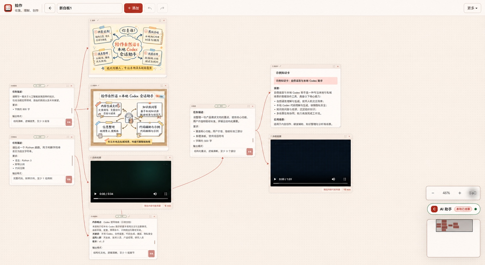
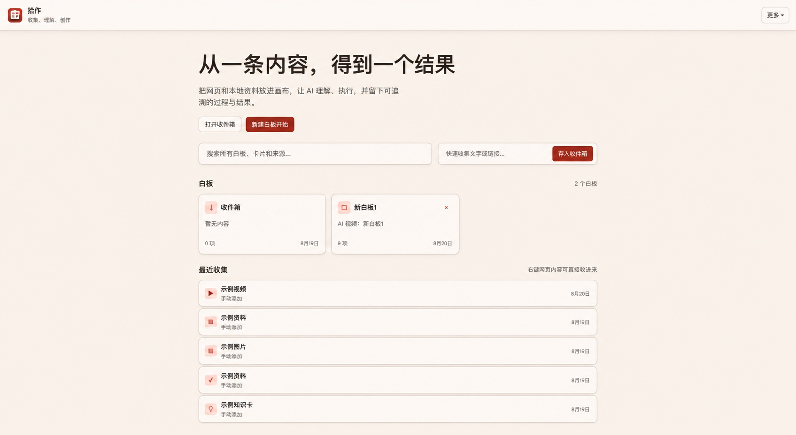

# Shizuo · 拾作

> **A local-first visual workspace for Codex.** Capture context from the web, organize it on an infinite canvas, and let local agents act with visible, traceable results.

[简体中文](README.zh-CN.md) · [Download](https://github.com/Amossse/shizuo-codex-workspace/releases/latest) · [Setup](#quick-start) · [Privacy](PRIVACY.md)



## Why Shizuo

AI work becomes hard to follow when source material, prompts, progress, and results live in separate windows. Shizuo keeps them together:

- **Capture** selected text, pages, images, links, and local files with their sources.
- **Organize** cards and relationships on an infinite canvas with search and version history.
- **Act** on selected context with a local Codex CLI and see live status beside the source.
- **Keep** answers, images, knowledge cards, and reusable workflows where the work happened.

Board data stays in your browser by default. Content is sent to your local AI CLI only when you explicitly run a task.

## Quick start

### 1. Install the extension

1. Download and unzip the [latest release](https://github.com/Amossse/shizuo-codex-workspace/releases/latest).
2. Open `chrome://extensions` or `edge://extensions` and enable **Developer mode**.
3. Choose **Load unpacked**, select the extracted folder, and pin Shizuo.

You can now capture and organize content without Codex.

### 2. Capture your first item

Open a new tab, paste text, a link, or an image, then choose **Start organizing**. Shizuo places it on a board and shows the next action.



### 3. Connect local Codex (optional)

Install and sign in to the [Codex CLI](https://developers.openai.com/codex/cli), then run this once from the extracted Shizuo folder:

```sh
./install.sh --core
```

Reload Shizuo in `chrome://extensions`. The installer detects the unpacked extension automatically, registers the local Native Host and MCP, and verifies the bridge. See [local Codex setup](docs/local-codex-setup.md) if detection fails.

## Everyday actions

| Goal | Start here |
| --- | --- |
| Save a page or selection | Extension button or the selection menu |
| Open the canvas | A new tab or **Open Shizuo** |
| Ask Codex to work on context | Select cards, then choose **Send to AI** |
| Ask from the current page | Select text and choose **Ask Codex** |
| Find previous work | Search boards, cards, and sources from Home |

## Develop

There is no build step. Load the repository as an unpacked extension, edit the files, and reload it from `chrome://extensions`.

```sh
npm test
```

Runtime code lives under `app/`; the constrained local bridge lives under `native-host/`. See [architecture](docs/architecture.md), [capabilities](docs/capabilities.md), and [contributing](CONTRIBUTING.md).

## License

[MIT](LICENSE) © Shizuo Contributors
